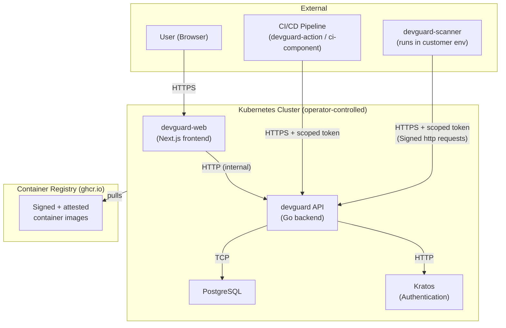

---
# Date this threat model was last reviewed and updated.
# Machine check: assert date is not older than 12 months. Additionally,
# the git log of this file is inspected — the last commit touching this file
# must not predate this value, ensuring the field is not stale.
last_reviewed: 2026-03-26

# URL(s) to threat model documents, architecture diagrams, or data flow diagrams.
# Machine check: HTTP GET → assert 200.
evidences: []
  # - url: https://docs.example.com/threat-model
---

# Threat Model and Risk Assessment

## Annex VII — Cybersecurity Risk Assessment

> 3. an assessment of the cybersecurity risks against which the product with digital elements is designed, developed,
> produced, delivered and maintained pursuant to Article 13, including how the essential cybersecurity requirements set
> out in Part I of Annex I are applicable;

**Question: What cybersecurity risks have been identified for this product? (List threats, threat actors, and attack scenarios considered.)** `[maintainer]`

DevGuard handles sensitive data including vulnerability findings, API tokens, deployment metadata, and access to customer repositories.

### Threat Actors Considered

- **External attackers**: Seeking to exfiltrate vulnerability data for exploitation intelligence, or to inject false scan results to mask real vulnerabilities in supply chains
- **Compromised CI/CD pipelines**: Attacker controls a pipeline token and attempts to submit manipulated scan results or exfiltrate data from the DevGuard API
- **Malicious insiders**: Users with legitimate access who attempt to escalate privileges, access other organisations' data, or repudiate vulnerability management decisions
- **Supply chain attackers**: Attempting to tamper with DevGuard's own build artefacts, dependencies, or vulnerability database to compromise downstream users

### STRIDE Analysis

Identified threats follow the STRIDE model:

| Threat | Component | Risk |
|---|---|---|
| Spoofing | API authentication | Attacker impersonates a legitimate user or CI pipeline to inject false scan results or exfiltrate vulnerability data |
| Tampering | SBOM and provenance data | Attacker modifies scan results, SBOMs, or provenance attestations to hide vulnerabilities or inject false findings |
| Repudiation | Vulnerability findings | Actors deny having accepted risk or modified vulnerability status |
| Information Disclosure | Customer vulnerability data | Attacker gains access to vulnerability findings of other organisations |
| Denial of Service | API | Attacker overwhelms the API to prevent vulnerability scanning and compliance workflows |
| Elevation of Privilege | Kubernetes deployment | Attacker escapes container or exploits misconfiguration to gain cluster-level access |

**Question: What method was used for threat modelling? (e.g., STRIDE, PASTA, OWASP Threat Dragon, attack trees)** `[maintainer]`

STRIDE analysis applied to the system architecture, covering all trust boundaries and data flows.

**Question: How are the outcomes of this risk assessment reflected in the product's design and development decisions?** `[maintainer]`

Each identified threat maps to a concrete mitigation implemented in the product:

| Threat | Mitigation |
|---|---|
| Spoofing | Three authentication layers: Ory Kratos session cookies for interactive users, ECDSA P-256 HTTP Message Signing (RFC 9421) for scanner integrations,  administrative access based on ECDSA P-256 HTTP Message Signing (RFC 9421) too. PATs are scoped per asset and action. **Residual risk**: PATs have no expiry — a compromised PAT remains valid until manually revoked. |
| Tampering | Cosign signatures on all container images; optionally enforced at deploy time via Kyverno admission policies. Scanner submissions are integrity-protected via `Content-Digest` headers verified server-side. |
| Repudiation | All vulnerability state changes are recorded as `VulnEvent` records with user ID, justification, timestamp, and mechanical justification type. |
| Information Disclosure | Organisation-scoped data isolation enforced via Casbin RBAC with domain-scoped policies, evaluated on every API request. **Residual risk**: OAuth integration tokens (GitHub, GitLab) are stored as plaintext in the database. |
| Denial of Service | Kubernetes resource limits (CPU, memory) defined on all containers. NetworkPolicies restrict inbound traffic. Rate limiting delegated to ingress controller. **Residual risk**: no application-level rate limiting |
| Elevation of Privilege | Non-root containers (UID 53111), read-only root filesystem, all capabilities dropped, seccomp `RuntimeDefault`, `allowPrivilegeEscalation: false`. NetworkPolicies restrict pod-to-pod communication. |

**Question: What cybersecurity risks does this product pose to third parties (users, operators, interconnected systems) in the context of the manufacturer's specific deployment?** `[manufacturer]`

This question must be answered by the operator for their specific deployment. The following product-level risks to third parties are identified by the maintainer:

- **Data breach impact**: DevGuard stores vulnerability findings, OAuth tokens for Git providers, and scan results. A breach could expose customers' vulnerability posture to attackers, enabling targeted exploitation.
- **Supply chain risk**: If DevGuard's vulnerability database or scan ingestion is compromised, false-negative results could propagate to downstream decision-making (e.g. marking vulnerable components as safe).
- **Git provider token abuse**: Stored OAuth tokens grant access to customers' GitHub/GitLab repositories. A database compromise could lead to unauthorised repository access.
- **Network impact**: DevGuard makes outbound HTTPS calls to container registries to fetch vulnerability database updates. Misconfiguration or compromise could result in unexpected network traffic from the operator's infrastructure.

---

## Annex I, Part I(2)(j) — Attack Surface Reduction

> (j) be designed, developed and produced to limit attack surfaces, including external interfaces;

**Question: What external interfaces does this product expose (APIs, network ports, protocols, hardware interfaces)?** `[maintainer]`

External interfaces:
- HTTPS (443) — web frontend and API, exposed via Ingress
- No other ports are exposed externally by default

**Question: How have unnecessary interfaces, services, and entry points been eliminated or restricted to reduce the attack surface?** `[maintainer]`

- NetworkPolicies (enabled by default) restrict inbound pod-to-pod communication: PostgreSQL accepts only API and Kratos; Kratos admin port accepts only API; web accepts only ingress controller traffic
- The database is not exposed outside the cluster
- Kratos admin port (4434) is only accessible from the API pod; the public port (4433) is accessible from API and web pods
- Container images use minimal base images with minimal attack surface. The scanner image uses Alpine.
- The devguard-scanner CLI is outbound-only — it makes HTTP POST requests to the API and never listens on any port
- All containers run as non-root (UID 53111) with read-only root filesystem and all capabilities dropped

**Question: What interfaces or services are disabled, restricted, or not compiled by default to reduce the attack surface?** `[maintainer]`

- API tokens are scoped per asset and per action (`scan`, `manage`)
- CI/CD tokens have the minimal scope needed for their function
- RBAC roles cascade hierarchically (organisation → project → asset) with the most restrictive applicable role
- Public access is an explicit opt-in, defaulting to authenticated-only

---

## Annex I, Part I(2)(i) — Minimise Negative Impact on Other Devices and Networks

> (i) minimise the negative impact by the products themselves or connected devices on the availability of services
> provided by other devices or networks;

**Question: Could this product's behaviour (e.g., network traffic, resource consumption, broadcast storms, cascading failures) negatively affect other devices or networks it connects to?** `[maintainer]`

DevGuard's network communication is limited to:
- HTTPS API calls (request/response pattern, no long-lived connections or broadcast)
- PostgreSQL TCP connections (internal, connection-pooled)
- Outbound HTTPS to container registries for vulnerability database updates (periodic, bounded)
- Outbound HTTPS to Git providers (GitHub, GitLab) for project structure synchronisation and issue tracker integration. Deep sync of repository/project structures can generate a high volume of API requests. Outbound calls to GitLab are rate-limited (10 req/s via `golang.org/x/time/rate`).

Resource consumption is bounded by Kubernetes resource limits defined in the Helm chart.

**Question: What design measures have been taken to limit the product's potential negative impact on connected infrastructure?** `[maintainer]`

- Kubernetes resource limits (CPU and memory) prevent unbounded resource consumption
- Network policies restrict communication to explicitly allowed paths, preventing unintended network traffic
- Database connection pooling (25 max connections, configurable) prevents connection exhaustion
- Vulnerability database updates are periodic (every 6 hours) and bounded in scope
- Outbound API calls to GitLab are rate-limited at 10 req/s to avoid overwhelming upstream APIs during project structure synchronisation and issue sync