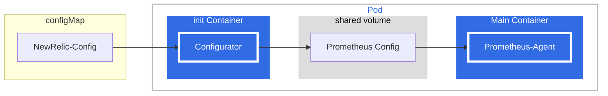

# newrelic-prometheus-agent

A Helm chart to deploy Prometheus with New Relic Prometheus Configurator.

# Description

This chart deploys Prometheus Server in Agent mode configured by the `newrelic-prometheus-configurator`.

The solution is deployed as a StatefulSet for sharding proposes.
Each Pod will execute the `newrelic-prometheus-configurator` init container which will convert the provided config to a config file in the Prometheus format. Once the init container finishes and saves the config in a shared volume, the container running Prometheus in Agent mode will start.



# Helm installation

You can install this chart using [`nri-bundle`](https://github.com/newrelic/helm-charts/tree/master/charts/nri-bundle) located in the
[helm-charts repository](https://github.com/newrelic/helm-charts) or directly from this repository by adding this Helm repository:

```shell
helm repo add newrelic-prometheus https://newrelic.github.io/newrelic-prometheus-configurator
helm upgrade --install newrelic newrelic-prometheus/newrelic-prometheus-agent -f your-custom-values.yaml
```

## Values managed globally

This chart implements the [New Relic's common Helm library](https://github.com/newrelic/helm-charts/tree/master/library/common-library) which
means that it honors a wide range of defaults and globals common to most New Relic Helm charts.

Options that can be defined globally include `affinity`, `nodeSelector`, `tolerations`, `proxy` and others. The full list can be found at
[user's guide of the common library](https://github.com/newrelic/helm-charts/blob/master/library/common-library/README.md).

## Chart particularities

### Configuration

The configuration used is similar to the [Prometheus configuration](https://prometheus.io/docs/prometheus/latest/configuration/configuration/), but it includes some syntactic sugar to make easy to set up some special use-cases like Kubernetes targets, sharding and some New Relic related settings like remote write endpoints.

The configurator will create [scrape_config](https://prometheus.io/docs/prometheus/latest/configuration/configuration/#scrape_config), [relabel_config](https://prometheus.io/docs/prometheus/latest/configuration/configuration/#relabel_config), [remote_write](https://prometheus.io/docs/prometheus/latest/configuration/configuration/#remote_write) and other entries based on the defined configuration.

As general rules:
- Configs parameters having the same name as the [Prometheus configuration](https://prometheus.io/docs/prometheus/latest/configuration/configuration/) should have similar behavior. For example, the `tls_config` defined inside a `Kubernetes.jobs` will have the same definition as [tls_config](https://prometheus.io/docs/prometheus/latest/configuration/configuration/#tls_config) of Prometheus and will affect all targets scraped by that job.
- Configs starting with `extra_` prefix will be appended to the ones created by the Configurator. For example, the relabel configs defined in `extra_relabel_config` on the Kubernetes section will be appended to the end of the list that is already being generated by the Configurator for filtering, sharding, metadata decoration, etc.

### Default Kubernetes jobs configuration

By default, some Kubernetes objects are discovered and scraped by Prometheus. Taking into account the snippet from `values.yaml` below:

```yaml
    integrations_filter:
      enabled: true
      source_labels: ["app.kubernetes.io/name", "app.newrelic.io/name", "k8s-app"]
      app_values: ["redis", "traefik", "calico", "nginx", "coredns", "etcd", "cockroachdb", "velero", "harbor", "argocd"]
    jobs:
    - job_name_prefix: default
      target_discovery:
        pod: true
        endpoints: true
        filter:
          annotations:
            prometheus.io/scrape: true
    - job_name_prefix: newrelic
      integrations_filter:
        enabled: false
      target_discovery:
        pod: true
        endpoints: true
        filter:
          annotations:
            newrelic.io/scrape: true
```

All pods and endpoints with the `newrelic.io/scrape: true` annotation will be scraped by default.

Moreover, the solution will scrape as well all pods and endpoints with the `prometheus.io/scrape: true` annotations and
having one of the labels matching the integrations_filter configuration.

Notice that at any point you can turn off the integrations filters and scrape all pods and services annotated with
`prometheus.io/scrape: true` by setting `config.kubernetes.integrations_filter.integrations_filter: false` or turning
it off in any specific job.

### Kubernetes job examples

#### API Server metrics
By default, the API Server Service named `kubernetes` is created in the `default` namespace. The following configuration will scrape metrics from all endpoints behind the mentioned service using the Prometheus Pod bearer token as Authorization Header:

```yaml
config:
  kubernetes:
    jobs:
    - job_name_prefix: apiserver
      target_discovery:
        endpoints: true
      extra_relabel_config:
      # Filter endpoints on `default` namespace associated to `kubernetes` service.
      - source_labels: [__meta_kubernetes_namespace, __meta_kubernetes_service_name]
        action: keep
        regex: default;kubernetes

      scheme: https
      tls_config:
          ca_file: /var/run/secrets/kubernetes.io/serviceaccount/ca.crt
          insecure_skip_verify: true
      authorization:
        credentials_file: /var/run/secrets/kubernetes.io/serviceaccount/token
```

### Metrics Filtering

Check [docs](https://github.com/newrelic/newrelic-prometheus-configurator/blob/main/docs/MetricsFilters.md) for a detailed explanation and examples of how to filter metrics and labels.

### Self metrics

By default, it is defined as a job in `static_target.jobs` to obtain self-metrics. Particularly, a snippet like the one
below is used. If you define your own static_targets jobs, it is important to also include this kind of job in order
to keep getting self-metrics.

```yaml
config:
  static_targets:
    jobs:
    - job_name: self-metrics
      targets:
        - "localhost:9090"
      extra_metric_relabel_config:
        - source_labels: [__name__]
          regex: "<metrics to include defined in values.yaml>"
          action: keep
```

### Low data mode

There are two mechanisms to reduce the amount of data that this integration sends to New Relic. See this snippet from the `values.yaml` file:
```yaml
lowDataMode: false

config:
  common:
    scrape_interval: 30s
```

You might set `lowDataMode` flag to `true` (it will filter some metrics which can also be collected using New Relic Kubernetes integration), check
`values.yaml` for details.

It is also possible to adjust how frequently Prometheus scrapes the targets by setting up the` config.common.scrape_interval` value.

### Affinities and tolerations

The New Relic common library allows you to set affinities, tolerations, and node selectors globally using e.g. `.global.affinity` to ease the configuration
when you use this chart using `nri-bundle`. This chart has an extra level of granularity to the components that it deploys:
control plane, ksm, and kubelet.

Take this snippet as an example:
```yaml
global:
  affinity: {}
affinity: {}
```

The order to set the affinity is to set `affinity` field (at root level), if that value is empty, the chart fallbacks to `global.affinity`.

## Values

| Key | Type | Default | Description |
|-----|------|---------|-------------|
| affinity | object | `{}` | Sets pod/node affinities set almost globally. (See [Affinities and tolerations](README.md#affinities-and-tolerations)) |
| cluster | string | `""` | Name of the Kubernetes cluster monitored. Can be configured also with `global.cluster`. Note it will be set as an external label in prometheus configuration, it will have precedence over `config.common.external_labels.cluster_name` and `customAttributes.cluster_name``. |
| config | object | See `values.yaml` | It holds the New Relic Prometheus configuration. Here you can easily set up Prometheus to get set metrics, discover ponds and endpoints Kubernetes and send metrics to New Relic using remote-write. |
| config.common | object | See `values.yaml` | Include global configuration for Prometheus agent. |
| config.common.scrape_interval | string | `"30s"` | How frequently to scrape targets by default, unless a different value is specified on the job. |
| config.extra_remote_write | object | `nil` | It includes additional remote-write configuration. Note this configuration is not parsed, so valid [prometheus remote_write configuration](https://prometheus.io/docs/prometheus/latest/configuration/configuration/#remote_write) should be provided. |
| config.extra_scrape_configs | list | `[]` | It is possible to include extra scrape configuration in [prometheus format](https://prometheus.io/docs/prometheus/latest/configuration/configuration/#scrape_config). Please note, it should be a valid Prometheus configuration which will not be parsed by the chart. WARNING extra_scrape_configs is a raw Prometheus config. Therefore, the metrics collected thanks to it will not have by default the metadata (pod_name, service_name, ...) added by the configurator for the static or kubernetes jobs. This configuration should be used as a workaround whenever kubernetes and static job do not cover a particular use-case. |
| config.kubernetes | object | See `values.yaml` | It allows defining scrape jobs for Kubernetes in a simple way. |
| config.kubernetes.integrations_filter.app_values | list | `["redis","traefik","calico","nginx","coredns","kube-dns","etcd","cockroachdb","velero","harbor","argocd"]` | app_values used to create the regex used in the relabel config added by the integration filters configuration. Note that a single regex will be created from this list, example: '.*(?i)(app1|app2|app3).*' |
| config.kubernetes.integrations_filter.enabled | bool | `true` | enabling the integration filters, merely the targets having one of the specified labels matching    one of the values of app_values are scraped. Each job configuration can override this default. |
| config.kubernetes.integrations_filter.source_labels | list | `["app.kubernetes.io/name","app.newrelic.io/name","k8s-app"]` | source_labels used to fetch label values in the relabel config added by the integration filters configuration |
| config.newrelic_remote_write | object | See `values.yaml` | Newrelic remote-write configuration settings. |
| config.static_targets | object | See `values.yaml`. | It allows defining scrape jobs for targets with static URLs. |
| config.static_targets.jobs | list | See `values.yaml`. | List of static target jobs. By default, it defines a job to get self-metrics. Please note, if you define `static_target.jobs` and would like to keep self-metrics you need to include a job like the one defined by default. |
| containerSecurityContext | object | `{}` | Sets security context (at container level). Can be configured also with `global.containerSecurityContext` |
| customAttributes | object | `{}` | Adds extra attributes to prometheus external labels. Can be configured also with `global.customAttributes`. Please note, values defined in `common.config.externar_labels` will have precedence over `customAttributes`. |
| customSecretLicenseKey | string | `""` | In case you don't want to have the license key in you values, this allows you to point to which secret key is the license key located. Can be configured also with `global.customSecretLicenseKey` |
| customSecretName | string | `""` | In case you don't want to have the license key in you values, this allows you to point to a user created secret to get the key from there. Can be configured also with `global.customSecretName` |
| dnsConfig | object | `{}` | Sets pod's dnsConfig. Can be configured also with `global.dnsConfig` |
| extraVolumeMounts | list | `[]` | Defines where to mount volumes specified with `extraVolumes` |
| extraVolumes | list | `[]` | Volumes to mount in the containers |
| fullnameOverride | string | `""` | Override the full name of the release |
| hostNetwork | bool | `false` | Sets pod's hostNetwork. Can be configured also with `global.hostNetwork` |
| images.configurator | object | See `values.yaml` | Image for New Relic configurator. |
| images.prometheus | object | See `values.yaml` | Image for prometheus which is executed in agent mode. |
| images.pullSecrets | list | `[]` | The secrets that are needed to pull images from a custom registry. |
| labels | object | `{}` | Additional labels for chart objects. Can be configured also with `global.labels` |
| licenseKey | string | `""` | This set this license key to use. Can be configured also with `global.licenseKey` |
| lowDataMode | bool | false | Reduces the number of metrics sent in order to reduce costs. It can be configured also with `global.lowDataMode`. Specifically, it makes Prometheus stop reporting some Kubernetes cluster-specific metrics, you can see details in `static/lowdatamodedefaults.yaml`. |
| metric_type_override | object | `{"enabled":true}` | It holds the configuration for metric type override. If enabled, a series of metric relabel configs will be added to `config.newrelic_remote_write.extra_write_relabel_configs`, you can check the whole list in `static/metrictyperelabeldefaults.yaml` |
| nameOverride | string | `""` | Override the name of the chart |
| nodeSelector | object | `{}` | Sets pod's node selector almost globally. (See [Affinities and tolerations](README.md#affinities-and-tolerations)) |
| nrStaging | bool | `false` | Send the metrics to the staging backend. Requires a valid staging license key. Can be configured also with `global.nrStaging` |
| podAnnotations | object | `{}` | Annotations to be added to all pods created by the integration. |
| podLabels | object | `{}` | Additional labels for chart pods. Can be configured also with `global.podLabels` |
| podSecurityContext | object | `{}` | Sets security context (at pod level). Can be configured also with `global.podSecurityContext` |
| priorityClassName | string | `""` | Sets pod's priorityClassName. Can be configured also with `global.priorityClassName` |
| rbac.create | bool | `true` | Whether the chart should automatically create the RBAC objects required to run. |
| rbac.pspEnabled | bool | `false` | Whether the chart should create Pod Security Policy objects. |
| resources | object | `{}` | Resource limits to be added to all pods created by the integration. |
| serviceAccount | object | See `values.yaml` | Settings controlling ServiceAccount creation. |
| serviceAccount.create | bool | `true` | Whether the chart should automatically create the ServiceAccount objects required to run. |
| sharding | string | See `values.yaml` | Set up Prometheus replicas to allow horizontal scalability. |
| tolerations | list | `[]` | Sets pod's tolerations to node taints almost globally. (See [Affinities and tolerations](README.md#affinities-and-tolerations)) |
| verboseLog | bool | `false` | Sets the debug log to Prometheus and prometheus-configurator or all integrations if it is set globally. Can be configured also with `global.verboseLog` |

## Maintainers

* [nserrino](https://github.com/nserrino)
* [philkuz](https://github.com/philkuz)
* [htroisi](https://github.com/htroisi)
* [juanjjaramillo](https://github.com/juanjjaramillo)
* [svetlanabrennan](https://github.com/svetlanabrennan)
* [nrepai](https://github.com/nrepai)
* [csongnr](https://github.com/csongnr)
* [vuqtran88](https://github.com/vuqtran88)
* [xqi-nr](https://github.com/xqi-nr)
